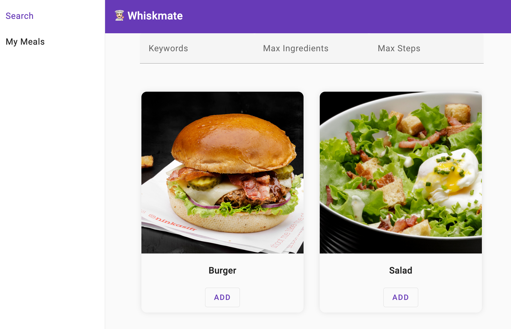
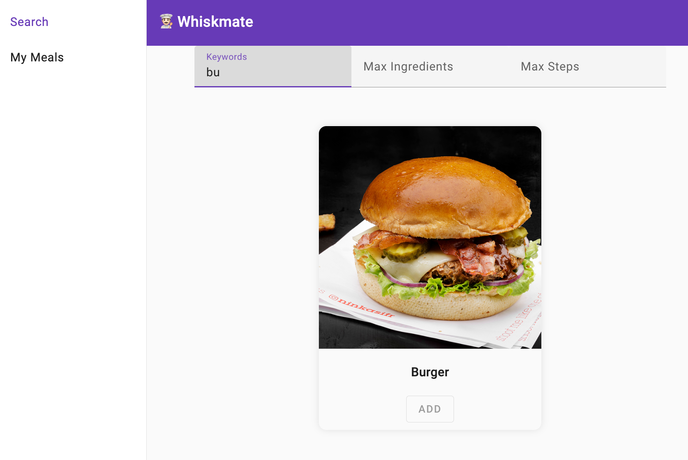

# 💃 The Limbo Game 🕺

# Table of Contents

- [Context](#context)
- [Rules](#rules)
- [App requirements](#app-requirements)
- [Scoring system](#scoring-system)
- [Useful information & resources](#useful-information--resources)
  - [A list of recipes to fill the database with](#a-list-of-recipes-to-fill-the-database-with)
  - [Docs](#docs)
  - [Testing & Dependency Injection](#testing--dependency-injection)
- [Useful commands](#useful-commands)
  - [Running build, lint & tests](#running-build-lint--tests)
  - [Limbo](#limbo)
  - [Autorevert](#autorevert)
  - [TCR](#tcr)

## Context

Conventional development workflows _(i.e. based on branching, PRs, Code Review, manual testing, etc...)_ will often have the following drawbacks:

- slow feedback loop
- slow development workflow
- high risk of merge conflicts _(and associated waste of time + risk of breaking things during merge)_
- more silos and less collective ownership
- multitasking _(e.g. working on lower priority tasks while waiting for feedback on higher priority tasks)_

To avoid these drawbacks, we will try to use a workflow based on [Kent Beck's Limbo](https://medium.com/@kentbeck_7670/limbo-scaling-software-collaboration-afd4f00db4b):
> Limbo is live, shared programming. It balances precariously between two principles:
> - Everyone is working on (and production is executing) the same program, represented by a single abstract syntax tree.
> - No one is allowed to cause others (including users) problems.

In this workshop, we will restrict ourselves with some extreme rules _(cf. [Rules](#rules))_ and see what we can learn from that.

## Rules

1. ☝️ all developers must commit to the same branch _(i.e. **no branching** / **no PRs**)_
2. 🐒 manual testing is forbidden _(i.e. **starting the app is not allowed, but TDD is highly encouraged 😉**)_
3. 🗑️ in case of conflict, the first commit wins _(i.e. **never fix conflicts**)_
4. ✅ ci workflow should never break _(except missing visual regression snapshots)_
5. 🔗 each commit must be propagated immediately _(i.e. each commit must be pushed immediately and pulled by others)_ _(cf. [Limbo](#limbo))_
6. ⏳ all developers must use [autorevert](#autorevert) or [tcr](#tcr)

## App requirements

- [ ] User should be able to list all recipes.
- [ ] User should be able to filter recipes by keywords.
- [ ] User should be able to add recipes to "my meals".
- [ ] User should not be able to add the same recipe to "my meals" twice.
- [ ] User should be able to visit the details page of a recipe showing: ingredients, steps.

<details>
<summary>App Screenshots</summary>

### Recipe Search Page


### My Meals Page


</details>

## Scoring system

- `+10` points for each requirement implemented & tested _(`0` points if not tested)_.
- `-5` points for each CI workflow failure _(except missing visual regression snapshots)_.
- **🚨 CHEATING 🚨** : 15 minutes AFK penalty for the whole team.

## Useful information & resources

### A list of recipes to fill the database with
<details>
  <summary>The Recipes</summary>

```json
{
  "recipes": [
    {
      "id": "rec_1",
      "name": "Creamy Tomato Basil Pasta",
      "description": "A simple and delicious pasta dish with a creamy tomato basil sauce.",
      "pictureUrl": "https://dishingouthealth.com/wp-content/uploads/2022/09/CreamyTomatoPasta_Square.jpg",
      "steps": [
        "Cook the pasta according to package directions.",
        "While the pasta is cooking, heat the olive oil in a large skillet over medium heat.",
        "Add the garlic and cook until fragrant, about 30 seconds.",
        "Add the diced tomatoes, tomato paste, and basil. Bring to a simmer and cook for 10 minutes.",
        "Stir in the heavy cream and season with salt and pepper to taste.",
        "Drain the pasta and add it to the skillet with the sauce. Toss to coat.",
        "Serve immediately with grated Parmesan cheese."
      ],
      "ingredients": [
        "1 pound pasta",
        "1/4 cup olive oil",
        "3 cloves garlic, minced",
        "1 (14.5-ounce) can diced tomatoes, undrained",
        "2 tablespoons tomato paste",
        "1/2 cup fresh basil, chopped",
        "1/2 cup heavy cream",
        "Salt and pepper to taste"
      ]
    },
    {
      "id": "rec_2",
      "name": "Chili Cheese Quesadillas",
      "description": "A classic comfort food that's easy to make and always satisfying.",
      "pictureUrl": "https://mylifecookbook.com/wp-content/uploads/2022/11/chili-quesadilla-closeupSQ.jpg",
      "steps": [
        "Heat a large skillet over medium heat.",
        "Place a tortilla on the skillet and sprinkle with cheese.",
        "Top the cheese with your favorite chili toppings, such as shredded beef, beans, and onions.",
        "Add another tortilla to the top and press down gently.",
        "Cook for 2-3 minutes per side, or until the tortilla is golden brown and the cheese is melted.",
        "Cut the quesadilla into wedges and serve immediately."
      ],
      "ingredients": [
        "2 large flour tortillas",
        "1 cup shredded cheddar cheese",
        "1/2 cup chili, heated",
        "Shredded beef, beans, onions, and other toppings of your choice"
      ]
    },
    {
      "id": "rec_3",
      "name": "Chocolate Chip Cookies",
      "description": "A classic recipe that's always a hit.",
      "pictureUrl": "https://handletheheat.com/wp-content/uploads/2020/10/BAKERY-STYLE-CHOCOLATE-CHIP-COOKIES-9-637x637-1.jpg",
      "steps": [
        "Preheat oven to 375 degrees F (190 degrees C). Line baking sheets with parchment paper.",
        "In a large bowl, cream together the butter and sugars until light and fluffy. Beat in the egg and vanilla extract.",
        "In a separate bowl, whisk together the flour, baking soda, and salt. Gradually add to the wet ingredients, mixing until just combined. Do not overmix.",
        "Stir in the chocolate chips. Drop by rounded tablespoons onto the prepared baking sheets.",
        "Bake for 9-11 minutes, or until the edges are golden brown and the centers are set.",
        "Let the cookies cool on the baking sheets for a few minutes before transferring to a wire rack to cool completely."
      ],
      "ingredients": [
        "1 cup (2 sticks) unsalted butter, softened",
        "1 1/2 cups granulated sugar",
        "3/4 cup packed light brown sugar",
        "2 large eggs",
        "1 teaspoon pure vanilla extract",
        "2 1/2 cups all-purpose flour",
        "1 teaspoon baking soda",
        "1/2 teaspoon salt",
        "2 cups semisweet chocolate chips"
      ]
    },
    {
      "id": "rec_4",
      "name": "Savory Potato Pancakes",
      "description": "These savory potato pancakes are a delicious and easy-to-make appetizer or side dish. They are made with simple ingredients that you probably already have on hand.",
      "pictureUrl": "https://therecipecritic.com/wp-content/uploads/2021/02/potatopancakeshero.jpg",
      "steps": [
        "Peel and thinly slice the potatoes.",
        "In a large bowl, combine the potatoes, flour, eggs, parsley, salt, and pepper.",
        "Heat the oil in a large skillet over medium heat.",
        "Drop spoonfuls of potato mixture into the hot oil and cook until golden brown on both sides.",
        "Drain on paper towels and serve warm."
      ],
      "ingredients": [
        "2 pounds russet potatoes, peeled and thinly sliced",
        "1/2 cup all-purpose flour",
        "2 eggs",
        "1 tablespoon chopped fresh parsley",
        "1 teaspoon salt",
        "1/2 teaspoon black pepper",
        "Oil for frying"
      ]
    },
    {
      "id": "rec_5",
      "name": "Classic Margherita Pizza",
      "description": "A classic pizza recipe that's always a crowd-pleaser. Made with a simple dough, homemade tomato sauce, fresh mozzarella cheese, and basil, this pizza is sure to satisfy your cravings.",
      "pictureUrl": "https://ohsweetbasil.com/wp-content/uploads/four-cheese-margherita-pizza-recipe-12-scaled-1400x2100.jpg",
      "steps": [
        "In a large bowl, whisk together 2 cups of warm water, 1 teaspoon of sugar, and 1 packet of yeast. Let it sit for 5 minutes until foamy.",
        "Add 3 ½ cups of all-purpose flour, 2 tablespoons of olive oil, and 1 teaspoon of salt to the yeast mixture. Mix until a dough forms.",
        "Knead the dough on a lightly floured surface for 10 minutes, or until smooth and elastic.",
        "Place the dough in a lightly oiled bowl, cover with plastic wrap, and let it rise in a warm place for 1 hour, or until doubled in size.",
        "Preheat the oven to 450°F (230°C).",
        "While the dough is rising, make the tomato sauce. Heat 1 tablespoon of olive oil in a saucepan over medium heat. Add 1 clove of minced garlic and cook for 30 seconds until fragrant.",
        "Add 1 (28-ounce) can of crushed tomatoes and ½ teaspoon of salt. Bring to a simmer and cook for 15 minutes, or until the sauce has thickened.",
        "Stretch or roll the dough out into a 12-inch circle. Transfer the dough to a lightly greased pizza pan.",
        "Spread the tomato sauce evenly over the crust.",
        "Top with 8 ounces of shredded mozzarella cheese.",
        "Arrange 12 fresh basil leaves on top of the cheese.",
        "Bake for 10-15 minutes, or until the crust is golden brown and the cheese is melted and bubbly.",
        "Cut into slices and serve immediately."
      ],
      "ingredients": [
        "2 cups of warm water",
        "1 teaspoon of sugar",
        "1 packet of yeast",
        "3 ½ cups of all-purpose flour",
        "2 tablespoons of olive oil",
        "1 teaspoon of salt",
        "1 (28-ounce) can of crushed tomatoes",
        "1 clove of minced garlic",
        "8 ounces of shredded mozzarella cheese",
        "12 fresh basil leaves"
      ]
    },
    {
      "id": "rec_6",
      "name": "Tartiflette",
      "description": "A traditional French dish made with potatoes, Reblochon cheese, and lardons.",
      "pictureUrl": "https://img.taste.com.au/VqLW9HQ7/w720-h480-cfill-q80/taste/2017/06/tartiflette-127553-1.jpg",
      "steps": [
        "Preheat oven to 400°F (200°C).",
        "Slice potatoes thinly.",
        "In a large skillet, cook lardons over medium heat until crispy.",
        "Arrange potatoes in a greased baking dish.",
        "Pour half of the crème fraîche over the potatoes.",
        "Add lardons and sprinkle with salt and pepper.",
        "Cut the Reblochon cheese into wedges and arrange them on top of the potatoes.",
        "Cover with the remaining crème fraîche.",
        "Bake for 30-40 minutes, or until potatoes are tender and cheese is melted and bubbly.",
        "Serve hot."
      ],
      "ingredients": [
        "6 medium potatoes",
        "8 ounces smoked bacon, diced",
        "14 ounces Reblochon cheese, cut into wedges",
        "1 cup crème fraîche",
        "Salt and pepper to taste"
      ]
    }
  ]
}
```
</details>

### Docs

- [Playwright Component Testing](https://playwright.dev/docs/test-components)
- [Vitest Assertions](https://vitest.dev/api/expect.html)

### Testing & Dependency Injection

In order to replace dependencies with Test Doubles (e.g. fakes), we are using:

- for the frontend: React Context API. Cf. [greetings.pw.tsx](apps/whiskmate/src/app/greetings/greetings.pw.tsx) & [greetings.client.fake.tsx](apps/whiskmate/src/app/greetings/greetings.client.fake.tsx) for an example.
- for the backend: Tsyringe _which is wrapped in [di.ts](apps/recipes-api/src/di.ts)_. Cf. [greetings.router.spec.ts](apps/recipes-api/src/greetings/greetings.router.spec.ts) for an example.
- you can also stub requests at HTTP level with Playwright. Cf. [Playwright Handle Requests](https://playwright.dev/docs/network#handle-requests).

## Useful commands

### Running build, lint & tests

```sh
# Build all apps.
pnpm nx run-many --target=build

# Lint all apps and libs.
pnpm nx run-many --target=lint

# Test all apps and libs.
pnpm nx run-many --target=test

# Run Playwright Component testing
pnpm nx run-many --target=test-ui

# Run all targets on all projects
pnpm nx run-many --target=build,lint,test,test-ui

# Run some targets on some projects
pnpm nx run-many --projects=whiskmate,recipes-api --target=lint,test

# Run Playwright Component testing with interactive ui
pnpm nx test-ui recipes-api --ui

# Run web app tests in watch mode
pnpm nx test whiskmate --watch

# Run recipes API tests in watch mode
pnpm nx test recipes-api --watch
```

### Limbo

This will keep pushing / pulling your changes every 5 seconds.

```sh
pnpm limbo
```

### Autorevert

With this command, once you start making changes, you have 5 minutes to commit and push your changes. Otherwise, ALL your changes will be reverted.

```sh
pnpm autorevert 5
```

### TCR

This one is handing for refactoring.
If the tests are green, it will commit and push your changes. Otherwise, it will revert your changes (except test files).

```sh
pnpm tcr <commit-message>
```

### Reset

If things get weird with Playwright's Vite cache or anything similar...

```sh
pnpm reset
```
